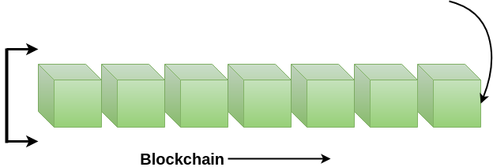
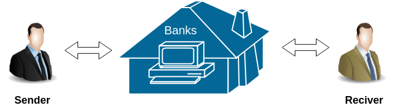
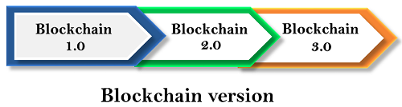
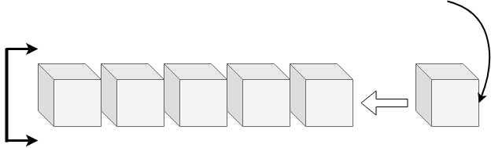
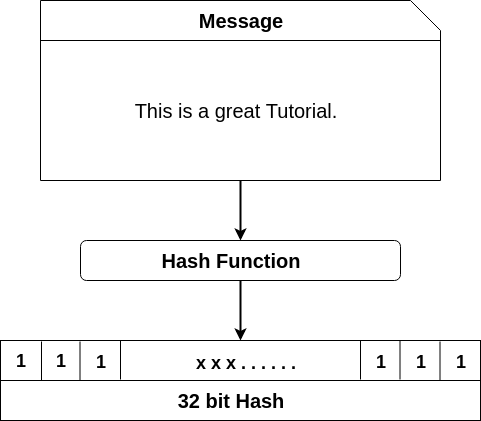
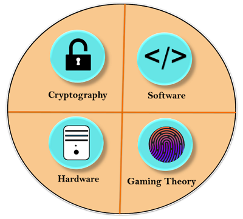
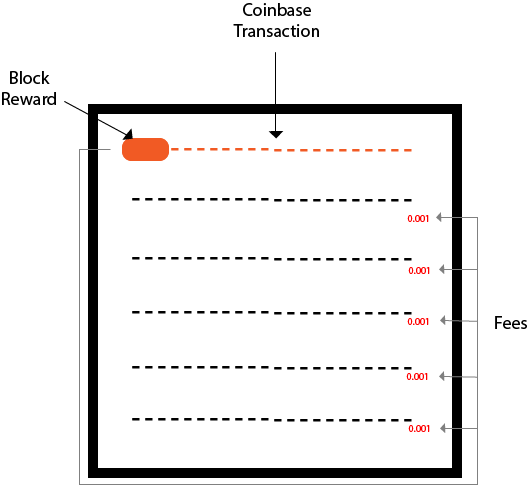

# `                         Blockchain LAB::Notes::My Journey!`


## What is Blockchain?



> A blockchain is a constantly growing ledger which keeps a permanent record of all the transactions that have taken place in a secure, chronological, and immutable way.

Let's breakdown the definition,

- **Ledger:** It is a file that is constantly growing.
- **Permanent:** It means once the transaction goes inside a blockchain, you can put up it permanently in the ledger.
- **Secure:** Blockchain placed information in a secure way. It uses very advanced cryptography to make sure that the information is locked inside the blockchain.
- **Chronological:** Chronological means every transaction happens after the previous one.
- **Immutable:** It means as you build all the transaction onto the blockchain, this ledger can never be changed.

## Why Blockchain is Popular?

Blockchain technology has become popular because of the following.

- **Time reduction:** In the financial industry, blockchain can allow the quicker settlement of trades. It does not take a lengthy process for verification, settlement, and clearance. It is because of a single version of agreed-upon data available between all stakeholders.
- **Unchangeable transactions:** Blockchain register transactions in a chronological order which certifies the unalterability of all operations, means when a new block is added to the chain of ledgers, it cannot be removed or modified.
- **Reliability:** Blockchain certifies and verifies the identities of each interested parties. This removes double records, reducing rates and accelerates transactions.
- **Security:** Blockchain uses very advanced cryptography to make sure that the information is locked inside the blockchain. It uses Distributed Ledger Technology where each party holds a copy of the original chain, so the system remains operative, even the large number of other nodes fall.
- **Collaboration:** It allows each party to transact directly with each other without requiring a third-party intermediary.
- **Decentralized:** It is decentralized because there is no central authority supervising anything. There are standards rules on how every node exchanges the blockchain information. This method ensures that all transactions are validated, and all valid transactions are added one by one.

## History-Short

In **2008**, **Satoshi Nakamoto** conceptualized the theory of **distributed blockchains**. He improves the design in a unique way to add blocks to the initial chain without requiring them to be signed by trusted parties. The modified trees would contain a secure history of data exchanges. It utilizes a peer-to-peer network for timestamping and verifying each exchange. It could be managed autonomously without requiring a central authority. These improvements were so beneficial that makes blockchains as the backbone of cryptocurrencies. Today, the design serves as the public ledger for all transactions in the cryptocurrency space.

The evolution of blockchains has been steady and promising. The words block and chain were used separately in Satoshi Nakamoto's original paper but were eventually popularized as a single word, the Blockchain, by **2016**. In recent time, the file size of cryptocurrency blockchain containing records of all transactions occurred on the network has grown from **20 GB** to **100 GB**.

## What is Bitcoin?

> A bitcoin is a type of digital assets which can be bought, sold, and transfer between the two parties securely over the internet. Bitcoin can be used to store values much like fine gold, silver, and some other type of investments. We can also use bitcoin to buy products and services as well as make payments and exchange values electronically.

 It is commonly called **decentralized digital currency**.

## How Bitcoin Works?

**For example**, Suppose you click on a photo that you want to send it to another person, so you can simply attach that photo to an email, type the receiver email address and send it. The other person will receive the photo, and you think it would end, but it is not. Now, we have two copies of photo, one is a simple email, and another is an original file which is still on my computer. Here, we send the copy of the file of the photo, not the original file. This issue is commonly known as the **double-spend** problem.



The double-spend problem provides a challenge to determine whether a transaction is real or not. How you can send a bitcoin to someone over the internet without needing a bank or some other institution to certify the transfer took place. The answer arises in a global network of thousands of computers called a Bitcoin Network and a special type of decentralized laser technology called **blockchain**.

In Bitcoin, all the information related to the transaction is captured securely by using maths, protected cryptographically, and the data is stored and verified across the entire network of computers. In other words, instead of having a centralized database of the third-party such as banks to certify the transaction took place.

## Blockchain Version



**Blockchain 1.0: Currency**

Bitcoin is the most prominent example in this segment. It is being used as **cash for the Internet** and seen as the enabler of an **Internet of Money**.

** Blockchain 2.0: Smart Contracts**

The main issues that came with Bitcoin are wasteful mining and lack of network scalability. To overcome these issues, this version extends the concept of Bitcoin beyond currency. The new key concepts are Smart Contracts. It is small computer programs that **"live"** in the blockchain. They are free computer programs which executed automatically and checked conditions which are defined earlier like facilitation, verification or enforcement. The big advantage of this technology that blockchain offers, making it impossible to tamper or hack Smart Contracts. A most prominent example is the Ethereum Blockchain, which provides a platform where the developer community can build distributed applications for the Blockchain network.

Quickly, the blockchain 2.0 version is successfully processing a high number of daily transactions on a public network, where millions were raised through **ICO** (Initial Coin Offerings), and the market cap increased rapidly.

**Blockchain 3.0: DApps**

DApps is also known as a decentralized application. It uses decentralized storage and communication. Its backend code is running on a decentralized peer-to-peer network. A DApp can have **frontend code** hosted on decentralized storages such as Ethereum Swarm and **user interfaces** written in any language that can make a call to its backend like a traditional Apps.

## How is the Bitcoin Blockchain built?

The role of a minor is to build the blockchain of records that forms the bitcoin ledger. These ledgers are called blocks, and each block contains all the different transactions that have taken place. A new block is added in **every 10 minutes** as a new Bitcoin Transaction takes place.  
So, as the minors process these different transactions, they build the block, and when a block is confirmed, it gets added to the blockchain. The bitcoin blockchain provides a permanent record of all bitcoin transactions to the beginning.

## Blockchain Hash Function

A hash function takes an input string (numbers, alphabets, media files) of any length and transforms it into a fixed length. The fixed bit length can vary (like 32-bit or 64-bit or 128-bit or 256-bit) depending on the hash function which is being used. The fixed-length output is called a hash. This hash is also the cryptographic byproduct of a hash algorithm. We can understand it from the following diagram.



**The hash algorithm has certain unique properties:**

1. It produces a unique output (or hash).

2. It is a one-way function


## How does the hashing process works?

**SHA-256**::A Bitcoin's blockchain uses SHA-256 (Secure Hash Algorithm) hashing algorithm. In 2001, SHA-256 Hashing algorithm was developed by the National Security Agency (NSA) in the USA.

Online Playground: http://onlinemd5.com/

## ::Block Chain 4 React Developer::

**Blockchain** is about building decentralized apps. Apps and data which are controlled by a community rather than a single organization.

**Ethereum** is a decentralized ie. blockchain platform that runs smart contracts i.e. applications that run exactly as programmed without any possibility of downtime, censorship, fraud or third-party interference.

For React developers, **Web3 **is a JS package to interact with Blockchain. TestRPC runs a node without the mining component. With Web3 and TestRPC, we can set our development environment for React apps **to interact with the blockchain.**

**Contracts** control the transfer of ether between accounts in a blockchain. Contracts are developed using Solidity language in Remix or Ethereum Studio. To manage contracts and test them, we use Truffle package from NPM.

**The Ethereum Virtual Machine**, also known as EVM, is the runtime environment for smart contracts in Ethereum. The Ethereum Virtual Machine focuses on providing security and executing untrusted code by computers all over the world.

***Smart Contracts*: **The Blockchain Technology That Will Replace Lawyers. ... *Smart contracts* allow the performance of credible transactions without third parties.

## How Block Hashes Work in Blockchain

A blockchain is a concept of storing data digitally. This data comes in blocks. These blocks are chained together and make the data **immutable**. When a block of data is chained with the other blocks, its data can never be changed again. 

## Basic Components of BitcoinIn 

This section, we are going to learn about the four basic components of bitcoin. These four elements will help us to understand the bitcoin blockchain in a more clear way. We can see the basic components of bitcoin in the following :

1. Software

2. Cryptography

3. Hardware

4. Miners(Gaming Theory)

    

   

**First Component: Software**

Bitcoin is basically a software at the core that defines what a bitcoin is, as well as how a bitcoin gets transferred. It identifies what the rules of a valid bitcoin, who can be inside bitcoin, who cannot be inside bitcoin, **what is valid, what is not,** etc. Everything is based on software, which is the bitcoin software. The bitcoin software is always operated in 24*7.

**Second component: Cryptography**
The software, at its core, uses cryptography and bitcoin as a cryptocurrency. Bitcoin uses cryptography to regulate the transfer of bitcoin between parties, as well as the creation of new units of bitcoin. Without cryptography, Bitcoin would simply not be possible. So, we've got that this software uses **cryptography to control the secure  transfer of bitcoin over the internet.**

Cryptography is a mathematical approach which is solvable by computers and not by humans. So all the stuff that protects your data is served by the cryptography.

**Third Component: Hardware**
To run and solve cryptography, it needs HARDWARE. This hardware is composed of those thousands of miners around the world running their computers. So there are thousands of computers around the world that are basically running the Bitcoin software or the Bitcoin client. **This hardware is specially designed for finding Nonce to validate block and hash. It requires a lot of CPU power to complete a simple task on the bitcoin blockchain.**

If you try to mine bitcoin right now with your smartphone or home computer, then you will End up losing your computer along with a hefty electric bill.

**Fourth Component: Mining(Gaming Theory)**
Miners are users who involved in a gaming theory because bitcoin is truly a game which is run by these miners around the world. In the above, we have seen that the first component is software for bitcoin that issues a cryptography challenge in every 10 minutes. The cryptography challenge involves in trying to find a Nonce which will make the hash for a specific block valid. All the hashes and validations are done by these miners. After successful creation of the block, the new block is added to the blockchain.

Let's see how gaming theory works!

**1.** Bitcoin software creates a challenge. Now, there is a game begins, and there is a race that goes off. The race involves all these miners competing against each other to solve the challenges.

**2.** This task or challenge will take approximately 10 minutes to be completed.

**3.** Every single miner starts trying to find the solution to that one Nonce that will satisfy the hash for the block.

**4.** At some specific point, one of those miners in the global community with higher speed and great hardware specs will solve the cryptography challenge and be the winner of that race.

**5. **Now, the rest of the community will start verifying that block which is mined by the winner. This makes Bitcoin so strong, because in one stage of this cycle, the miners are competing against each other, and in the next stage of the cycle, the rest of the community rallies together to ensure that that solution is correct.

**6.** If the Nonce is correct, it will end up with the new block which will be added to the blockchain.
For this task or challenge, the winner will earn a reward. That reward is currently 12.5 bitcoins.

## Blockchain Proof of work

Proof of Work(PoW) is the **original consensus algorithm** in a blockchain network. The algorithm is used to confirm the transaction and creates a new block to the chain. 

In this algorithm, **minors** (a group of people) compete against each other to complete the transaction on the network. The process of competing against each other is called **mining**. As soon as miners successfully created a valid block, he gets **rewarded**. The most famous application of Proof of Work(PoW) is Bitcoin.

## Coinbase Transaction



A coinbase transaction is the **first** transaction in a block. It is a **unique** type of bitcoin transaction that can be created by a miner. The miners use it to collect the block reward for their work and any other transaction fees collected by the miner are also sent in this transaction.

The miners are always responsible for creating a block. When a block is successfully created, he will be rewarded from bitcoin for their work.

## Explanation

Each transaction executed on the  network are combined together to form a block. When a block is formed, immediately, it will be added in the blockchain. Now, these blocks are immutable and tamper-proof for all transactions that are made on the bitcoin network. Each block must contain one or more transactions, and the first transaction in the block is called the **coinbase transaction**.


## Key Concepts of Bitcoin

There are four key concepts that you need to aware in Bitcoin. These are:

- Disintermediated
- Distributed
- Decentralized
- Trustless

**1. Disintermediated**

When you send money to someone over the Internet, you need a third party like banks which manages all your transactions. But in you are doing transactions directly to another party over the Internet. This transaction takes place in the Bitcoin network. This network takes care of confirming and verifying that there was a true transfer of value between the two parties. This concept is called Disintermediated.

The Disintermediated is the act of:
**a) Removing the middleman.
b) No 3rd Party like bank
c) No verification** 

**2. Distributed**

The entire bitcoin network runs on a network of thousands of distributed computers which shares the work. So, instead of having one centralized computer which handles the workload, you are distributing it across multiple computers. The distributed network is more reliable because there is no single point of failure. Here, **the work is shared across thousands of computers which are all running and sharing the workload.**

**3. Decentralized**

Bitcoin is decentralized. It means that there is **no central control,** no central repository of data and **no management in the middle** that overseeing what Bitcoin does. As a result, there is no central point of failure.

**4. Trustless**

Bitcoin is Trustless because there is no need to have a third-party, such as a bank to certify and bring trust to the entire process of transactions. Instead, the blockchain and how Bitcoin process the transactions enable the trust is done by Distributed Trustless Consensus in which all the nodes agree that a transaction took place.

## Blockchain Cryptocurrency

Cryptocurrency is a type of **digital asset** which is used to exchange value between parties. It uses strong **cryptography** to secure financial transactions and control the creation of new units of that currency and verify the transfer of assets. Cryptocurrency does not exist physically.

**1.Bitcoin**

Bitcoin is generally known as the first decentralized cryptocurrencies. It is created by the network of thousands of specific nodes called **miners**. The miners can process the bitcoin transactions in the blockchain network. Since the release of bitcoin, more than **4000** alternative variants of bitcoin are available now.

**2.Litecoin**

Litecoin cryptocurrency worked very similar to Bitcoin. We know that bitcoin wait **ten minutes** for a transaction block to be processed, but Litecoin can do this in maximum **two and a half minutes**. Litecoin doesn't have a big market cap. The price of Litecoin is lower than Bitcoin, but it's a very effective process and also has some variations from Bitcoin.

**3.Z-Cash**

Z-Cash is a **privacy-protecting** digital currency which is built-on strong science in cryptography. It provides enhanced privacy for its users as compared to other cryptocurrencies such as bitcoin. Here, transaction data is kept confidential, which is made possible through **zero-knowledge proofs**. It allows transactions to be verified without any information about the sender, receiver, and the amount transacted.

Z-Cash features known as **viewing keys** and **payment disclosure** makes it possible to disclose some of the user's transaction data. It makes the transactions on Z-Cash auditable and regulation-compliant.

**4.Monero**

Monero is an open-source cryptocurrency which focuses on **untraceable**, **privacy** and **decentralization**. It is fast, private, and secure digital cash, which is operated by a network of users. We can use it to buy and sell things and can exchange for other coins or tokens.

It uses a special kind of cryptography which ensures that the transactions remain 100% untraceable. It focuses on anonymity, which is harder to track, whereas Bitcoin is pseudonymous, which transactions are still traceable.

**5.Dash**

Dash is a short form of **Digital Cash**. It is an open-source cryptocurrency and is a form of a decentralized autonomous organization which is run by a subset of users, called master nodes. It is one of the most promising alternative coins to bitcoin. It permits very fast transactions, which are untraceable.

## Blockchain DAO
The DAO stands for **Decentralized Autonomous Organization**. As the name implies, it is an organization which is both autonomous and decentralized. Sometimes, it is also known as **Decentralized Autonomous Corporation** (DAC), but the term DAO is more often used because not all organizations are corporations.

A DAO is the most complex form of a **smart contract**. A smart contract is a computer program that autonomously exists on the internet, but at the same time, it needs people to perform a task that it can't do by itself.


## How Does DAO Works

**Let us take an example of Uber to understand the working of DAO**. Uber is an organization that allows you to call a car for yourself using a mobile app. Once you place your call, a driver will come up in a car, will pick you up and drive you to your destination. The app will take care of processing the payment, and the driver will be set off to go to the next rider. A mobile app runs the entire process. However, there is a human component, which is the driver that drives over and drives off.

Now, if you tie-in artificial intelligence, there is no reason to need a driver to come up and interact with you. You could have a self-driving car come over and pick you up. The whole thing is automated and self-executing so you can actually process the payment directly on the app and the car will interact with you directly, without requiring a human element. This type of process can be created into a Decentralized Autonomous Organization.

## How Bitcoin handles the Double Spending Problem?

**Double Spending: **Same BTC could be spent twice by its owner.

Bitcoin handles the double-spending problem by implementing a **confirmation mechanism** and maintaining a universal ledger called blockchain.

Let us suppose you have 1 BTC and try to spend it twice. You made the 1 BTC transaction to Alice. Again, you sign and send the same 1 BTC transaction to Bob. Both transactions go into the pool of unconfirmed transactions where many unconfirmed transactions are stored already. The unconfirmed transactions are transactions which do not pick by anyone. Now, whichever transaction first got confirmations and was verified by miners, will be valid. Another transaction which could not get enough confirmations will be pulled out from the network. In this example, transaction T1 is valid, and Alice will receive the bitcoin.

## Blockchain Merkle Tree

It is a mathematical ** hash data structure**which serves as a summary of all the transactions in a block for secure verification of content in a large body of data.

Both Bitcoin and Ethereum use Merkle Trees structure. Merkle Tree is also known as **Hash Tree**.

## How do Merkle trees work?


Merkle Root is stored in the **block header**. The block header is the part of the bitcoin block which gets hash in the process of mining. 

> It contains the hash of the **last block, a Nonce, and the Root Hash of all the transactions in the current block in a Merkle Tree Root**. So having the Merkle root in block header makes the transaction **tamper-proof**. 

As this Root Hash includes the hashes of all the transactions within the block, these transactions may result in saving the disk space.


## Blockchain VS Database

| **Blockchain**                                               | **Database**                                                 |
| :----------------------------------------------------------- | :----------------------------------------------------------- |
| Blockchain is decentralized because there is no admin or in-charge. | The database is centralized because it has admins and in-charge. |
| Blockchain is permissionless because anyone can access it.   | The database required permission because it can be accessed only by entities who have rights to access. |
| It has a history of records and ownership of digital records. | It has no history of records and ownership of records.       |
| Blockchain is fully confidential.                            | The database is not fully confidential.                      |
| Blockchain has only Insert operation.                        | The database has Create, Read, Update, and Delete operation. |
| It is a fully robust technology.                             | It is not entirely robust technology.                        |
| Disintermediation is allowed with blockchain.                | Disintermediation is not allowed with the database.          |
| Anyone with the right proof of work can write on the blockchain. | Only entities entitled to read or write can do so.           |
| Blockchain is not recursive. Here, we cannot go back to repeat a task on any record. | The database is recursive. Here, we can go back to repeat a task on a particular record. |
|                                                              |                                                              |


## Who sets the Bitcoin Price

Bitcoin is like a commodity. The price of bitcoin is determined by the market in which it trades. In other words, its price is determined by how much someone is willing to pay for that bitcoin. The market sets the price of bitcoin as same as Gold, Oil, Sugar, Grains, etc. is determined. Bitcoin, like any other market, is subject to the rules of supply and demand. i.e.

 ```
   More Demand, Less Supply = Price Goes Up 
   More Supply, Less Demand = Price Goes Down 
 ```

   

**No one, in particular**, sets the bitcoin's price nor we can trade it in one place. Each market/exchange determines its price based on supply and demand.

## Knowledge to feed your brain before starting

**1. Learn About Bitcoin**

It makes the blockchain different from actually sending of money with a bank where you may issue a stop payment or reversal of it's a wrong payment. Bitcoin is also fast and efficient as compared to physical currency.

**2. Choose Your Wallet**

After learning about Bitcoin, the first thing you need to do is to **install a wallet**. The wallet is a type of software that you install on your mobile device or your computer. It enables you to get into Bitcoin and create your own **addresses**.

**3. Get an Address**

An address in Bitcoin is very similar to an **e-mail address**, which is used to receive bitcoin. As opposed to an e-mail address where you have one e-mail address, you can have multiple addresses in bitcoin. It's a good practice to have multiple addresses for different needs. You may use bitcoin address for every single transaction you use.

**4. Public and Private Key**

When you open up your wallet, you will receive two valuable pieces of information. One of them is the **public key**, and another one is the **private key**. This information makes Bitcoin more interesting. With most businesses and different organizations, you need to have a **password** which you share with the people who are running the organization. So you can click on **Retrieve my password**, and you can get it back. 

->But in the case of bitcoin, you will get keys instead of a password. The **public key** that you can share with everybody, and a **private key** which only you know. The private key is an alphanumeric sequence which knows only you, and with them, you can remain completely in control of all the funds that go into your wallet.

Here, we are assuming that Alice has 20 bitcoins in her wallet. When the wallet is created, it assigns two keys. One is the **public key** which is used to **receive bitcoins**. And second is the **private key** which is used to **sign and authorize to send or spend those bitcoins **to other people. We know that Alice has the private key to her wallet, so she is able to spend those bitcoins.

**5. Get bitcoins**

Once you have your wallet, you can get bitcoins. There are different ways to get bitcoins. You can earn Bitcoins by doing a job or getting paid. You can also buy bitcoins it means you could go to an exchange and get bitcoin by put in dollars or whatever currency into bitcoin. You can also gift bitcoins and can receive them from others. So these are ways of getting bitcoin.

**6. Spend bitcoins**

Here, we are going to know about how you can spend bitcoin. You can send bitcoin to anyone. You can use bitcoin over millions of businesses at this moment Worldwide. Many of the best-known brands like Microsoft and Dell take bitcoin as payment. You can also use bitcoin to send payments and paying bills. It works great if you are actually sending payments to people in different currencies globally. You don't have to worry about having to change into different currencies. You can just pay in Bitcoin, and it's universal around the world.

# :zap:BlockChain-Interview

## What is Blockchain?
The blockchain is a decentralized distributed ledger technology(DLT). The purpose behind of is to provide a network of transparency, immutability, and trust. The blockchain is open source and provides equal opportunities for anyone to improve and implement it in their system.

Blockchain is a system of multiple nodes which acts as a distributed network over the internet, all over the world each node has the authority to make a transaction, verify a transaction, receive a transaction and create a block.

## What do you mean by blocks in the blockchain technology?
A block in the Blockcahin is nothing but just a list of records. When these lists are joined with each other, they are known as Blockchain.

## What do you mean by node in the blockchain technology?
A blockchain exists out of blocks of data. These blocks of data are stored on nodes (compare it to small servers). Nodes can be any kind of device (mostly computers, laptops or even bigger servers). Nodes form the infrastructure of a blockchain. All nodes on a blockchain are connected to each other and they constantly exchange the latest blockchain data with each other so all nodes stay up to date. They store, spread and preserve the blockchain data, so theoretically a blockchain exists on nodes. A full node is basically a device (like a computer) that contains a full copy of the transaction history of the blockchain.

## What are the various types of Blockchains?
**1. Public Blockchain**

A Public blockchain is a kind of blockchain which is "**for the people, by the people, and of the people**." There is no in-charge it means anyone can read, write, and audit the blockchain. It is an open-source, distributed, and decentralizes public ledger so anyone can review anything on a public blockchain. They are considered to be **Permissionless blockchain**.

**2. Private Blockchain**

A Private blockchain is a private property of an individual or an organization. It is controlled by a single organization that determines who can read it, submit the transaction to it, and who can participate in the consensus process. They are considered to be **permissioned blockchain**.

**3. Consortium Blockchain or Federated Blockchain**

In this blockchain, the consensus process is controlled by a pre-selected group, i.e., group of companies or representative individuals. These pre-selected group is coming together and making decisions for the best benefit of the whole network. Such groups are also called consortiums or a federation that's why the name consortium or federated blockchain.

## What was the difference between blockchain and tradiditonal database?
| Blockchain | Traditional Database |
| -----------| ---------------------|
| Centralized| Decentralized        |
| only insert operations | Data manipulation is possible |
| stored in block | stored in table |
| Full Replication of block on every peer | Master Slave Multi-Master |
| Majority of peers agree on the outcome of transactions |  Distributed Transactions (2 phase commit) |

## Please describle block structure of bitcoin blockchain
| Field |	Description |	Size (Bytes) |
| ------ | ------------ | ------|
| Magic no |  value always 0xD9B4BEF9 |	4 bytes |
| Blocksize |	number of bytes following up to end of block  |	4 bytes and onwords(up to 2 GB)|
| Blockheader |	consists of 6 items  |	80 bytes |
| Transaction counter | positive integer VI = VarInt |	1 - 9 bytes |
| transactions	| list of transactions	 | x number of transactions |

## Please describe blockheader structure of bitcoin blockchain header
| Field |	Purpose	| Updated when |	Size (Bytes) |
| ------- | ------ | ---------- | ------------|
| Version	| Block version number |	You upgrade the software and it specifies a new version |	4 |
| hashPrevBlock	| 256-bit hash of the previous block header |	A new block comes in |	32 |
| hashMerkleRoot |	256-bit hash based on all of the transactions in the block |	A transaction is accepted |	32 |
| Time	| Current block timestamp as seconds since 1970-01-01T00:00 UTC	| Every few seconds |	4 |
| Bits	| Current target in compact format |	The difficulty is adjusted |	4 |
| Nonce	| 32-bit number (starts at 0)	| A hash is tried (increments)	| 4 |

## Even when all 21 million bitcoins have been generated then after will create a new block?
Yes. The blocks are for proving that transactions existed at a particular time. Transactions will still occur once all the coins have been generated, so blocks will still be created as long as people are trading Bitcoins.

 ## Characterstics of Blockchain?
  * Decentralized Systems
  * Distributed ledger 
  * Safer & Secure Ecosystem 
  * Minting 

## what the mean of address in blockchain(as aspect of bitcoin)?
These are usually used to receive and send transactions on the network. Associate degree address may be a string of alphanumerical characters.

## Type of addresses(as aspect of bitcoin)?
* P2PKH-Pay To Public Key Hash(start with 1)
* P2SH-Pay To Script Hash(start with 3)
* Bech32-(start with bc1)

## If wrong address will be putted as recipient address. what happen?
Whenever you paste an address in your bitcoin wallet, it checks the prefix and calculates the checksum. If it doesn’t match, it rejects the address. This makes it impossible to send funds to a wrong address due to a typing error.

## What is altcoin?
An altcoin is any digital cryptocurrency similar to Bitcoin. The term is said to stand for “alternative to bitcoin” and is used describe any cryptocurrency that is not a Bitcoin.

## What is encryption? What is its role in Blockchain?
Data security always matters. Encryption is basically an approach that helps organizations to keep their data secure. The encrypted data is encoded or changed up to some extent before it is sent out of a network by the sender and only authorized parties can access that information.In Blockchain, this approach is useful because it simply adds more to the overall security and authenticity of blocks and helps to keep them secure.

## Is it possible to modify the data once it is written in a block?
No, it’s not possible to do so. In case any modification is required, the organization simply has to erase the information from all other blocks too.

## What are Block Identifiers?
In Blockchain, blocks can be identified by the block header hash and the block height.

## What exactly do you know about the security of a block?
Well, a block or the entire blockchain is protected by a strong cryptographic hash algorithm. Each block has a unique hash pointer. Any modification in the block constituents will result in the change in the hash identifier of the block.  Therefore, it offers an excellent level of security.

## What are Merkle trees? How important are Merkle trees in Blockchains?
Named after Ralph Merkle,Merkle Tree also is a data structure in cryptography in which each leaf node is a hash of a block of data, and each non-leaf node is a hash of its child nodes. 

## How is a blockchain ledger different from an ordinary one?
The first and in fact the prime difference is Blockchain is a digital ledger that can be decentralized very easily. The chances of error in this approach are far less than that in an ordinary ledger. An ordinary ledger is what that is prepared by hands or by human efforts while the Blockchain performs all its tasks automatically. You just need to configure it in a proper manner and by following all the guidelines.

## What type of records can be kept in a Blockchain? Is there any restriction on same?
There is no restriction on keeping records of any type in the Blockchain approach. Industries are using Blockchain for securing all types of records.

The common types of records (to name a few) that can be kept on the Blockchains are:
* Records of medical transactions
* Identity management
* Transaction processing
* Business transactions,
* Management activities
* Documentation

## A distributed digital ledger is used for recording transaction in Blockchain. What does the system rely on?
The system relies on the network servicing protocol and the nodes of the network.

## What’s is the difference between blockchain and centralized network?
The main difference between a centralized network and blockchain is how they are controlled. The blockchain is completely decentralized and doesn’t require a central authority. Inadvertently, it also brings benefits to blockchain such as trust, transparency, immutability and so on.

## What is a cryptocurrency?
Cryptocurrency is a digital currency that works without any centralized control. Cryptocurrency powers a lot of blockchain networks out there. They are also known as virtual currencies and differ from the likes of fiat currencies. For example, Bitcoin, Ethereum, and Litecoin are the example of cryptocurrencies.

## Are blockchain more trustworthy?
The blockchain is trustworthy because of many reasons. The first reason is the security that blockchain offers. It is the most secure technology solution right now. Next, it is entirely decentralized. This removes the need for a centralized entity and the risks associated with it.

The last feature that makes blockchain more trustworthy is immutability. Data once stored cannot be changed.

## What are the two types of records that Blockchain database support?
Blockchain database supports "transactional" and "block" record. Both the records can be accessed without any issues.

## What are the key elements of the blockchain ecosystem? Explain each of them briefly.
The blockchain has four key elements. They are as follows.
* Shared Ledger: Shared ledger is the logical component of a blockchain. It is decentralized in nature.
* Node Application: A node application is a software/solution that lets a computer connect with the blockchain. For example, Bitcoin uses a Bitcoin wallet application to identify each node on the network.
* Virtual Machine: The virtual machine handles all the tasks that a blockchain undertakes. It is part of the node application and provides an environment where instructions can run.
* Consensus Algorithm: The Consensus algorithm is used to set the blockchain rules by which every node can come to a conclusion. There are different consensus algorithm used in the blockchain.

## What is a Shared ledger? Explain in detail.
A Shared ledger is the data structure that is stored in a blockchain’s node application. It holds the content of the blockchain and ensures that every node can have access to it. Shared ledger is distributed in nature.

One of the good examples includes the Ethereum client where it has a ledger that interacts with other components such as payments, smart contracts etc. Each blockchain has its own way of managing its shared ledger keeping the basics intact.

## Can you share the names of platforms are that are actively developing Blockchain apps?
There are many organization or platform that are actively improving the blockchain ecosystem. Hyperledger community is one of the leading open source platforms that is working towards developing enterprise-grade blockchain solution.

Ethereum platform is also active in blockchain app development. They do differ in their approach. Ethereum provides developers, organization, and business to create blockchain apps, whereas Hyperledger is creating tools, techniques and other methods to empower the different blockchains.

## What is double spending?
Double spending is a process through which a digital currency is spent more than once. In other words, it also means a digital currency can be cloned. In blockchain technology, double spending is not possible.

## What cryptographic algorithms are frequently used in blockchain?
There are many cryptographic algorithms used in the blockchain. They are as follows:

* RSA
* Blowfish
* TripleDES
* AES

## What makes RSA a secure cryptographic algorithm?
RSA provides state of the security algorithm for applications to use. It stands for Riverst, Shamir, and Adelman. They are the developer of this algorithm. RSA offers public-key encryption and hence is applicable in a variety of use-cases including blockchain. It is also the first encryption that is widely used for signing data and encryption. It works by using both private and public key.

## Explain blind signature and how it is useful?
A blind signature is an essential part of cryptography where the information is blinded or encrypted. The information is signed and hence become encrypted. The approach is verified and ensure that privacy protocols are maintained in the network.

## Can RSA be attacked? If so, how?
Yes, hackers can attack RSA. However, being attacked is not equal to weak protection. It is just the methods that can be used to attack it and take a chance to break it. There are two ways, one can attack RSA, i.e., brutal force and mathematical attacks.

##  What are the key principles that need to be followed to make blockchain secure?
Even though blockchain is secure, it still needs to be implemented correctly. The following principles need to be followed for proper implementation.
* Auditing
* Security testing
* Securing applications
* Continuity planning
* Database security
* Digital workforce training.

## Explain a real-time blockchain use case?
Healthcare can use blockchain to their advantage. Many startups are currently working on a blockchain powered health app that lets patients store their information on the blockchain. The decentralized nature means that they don’t have to carry documents. Healthcare specialist can also take advantage of it as they can access the patient’s data anytime they want. Researchers also benefit from public blockchain where they can access large public data.

## What is the difference between public and private key?
A private key is used to encrypt a message or a transaction that is sent on the blockchain.  The sender can send a message using the public key of the receiver. The receiver, on the other hand, can decrypt the message or the transaction using his private key. This way the communication or transaction is kept safe from any temper.

## Will blockchain change the world?
The blockchain is going to revolutionize our daily life. It has the potential to change how we spend and transact. Also, it is already changing various sectors such as transport, education, business, and so on. As it allows a peer-to-peer network, it will become easier to do business without any geographical restrictions.

Healthcare, for example, will also benefit from it by providing a place to store information for seamless access by authorities and patients.

## What is Secret Sharing? Does it have any benefit in Blockchain technology?
It is a well-understood that security matters a lot in digital transactions. Secret sharing in Blockchain technology is an approach that divides secret or personal information into different units and sent them to the users on the network. The original information can only be combined when a member to whom a share of the secret is allocated agree to combine them together with others. There are several security-related advantages it can offer in Blockchain technology.

## Why Blockchain is a trusted approach?
Blockchain can be trusted due to several reasons. The very first thing is its compatibility with other business applications because of its open-source nature. Second one is its security. As it was intended for online transactions, the developers have paid special attention in keeping up the pace when it comes to its security. It really doesn’t matter what type of business one owns, Blockchain can easily be considered.

## What is Blockchain Durability and robustness?
Blockchain technology is like the internet in that it has a built-in robustness. By storing blocks of information that are identical across its network, the blockchain cannot:
1. Be controlled by any single entity.
2. Has no single point of failure.
Bitcoin was invented in 2008. Since that time, the Bitcoin blockchain has operated without significant disruption. (To date, any of problems associated with Bitcoin have been due to hacking or mismanagement. In other words, these problems come from bad intention and human error, not flaws in the underlying concepts.)
The internet itself has proven to be durable for almost 30 years. It’s a track record that bodes well for blockchain technology as it continues to be developed

## What is Transparent and incorruptible in blockchain?
The blockchain network lives in a state of consensus, one that automatically checks in with itself every ten minutes. A kind of self-auditing ecosystem of a digital value, the network reconciles every transaction that happens in ten-minute intervals. Each group of these transactions is referred to as a “block”. Two important properties result from this:
Transparency data is embedded within the network as a whole, by definition it is public. It cannot be corrupted altering any unit of information on the blockchain would mean using a huge amount of computing power to override the entire network.

## How does Bitcoin use Blockchain?
A transaction is a transfer of value between Bitcoin wallets that gets included in the blockchain. Bitcoin wallets keep a secret piece of data called a private key or seed, which is used to sign transactions, providing a mathematical proof that they have come from the owner of the wallet.

## What are the business benefits of blockchain?
Blockchain consensus mechanisms provide the benefits of a consolidated, consistent dataset with reduced errors, near-real-time reference data, and the flexibility for participants to change the descriptions of the assets they own.

Because no one participating member owns the source of origin for information contained in the shared ledger, blockchain technologies lead to increased trust and integrity in the flow of transaction information among the participating members.

Immutability mechanisms of blockchain technologies lead to lowered cost of audit and regulatory compliance with improved transparency. And because contracts being executed on business networks using blockchain technologies are smart, automated, and final, businesses benefit from increased speed of execution, reduced costs, and less risk, all of which enables businesses to build new revenue streams to interact with clients.

## What are blockchain requirements?
Blockchain is a truly disruptive technology that can transform business networks. We also believe that this innovation has to happen in the open, collaborating with other technology companies and industries. To this end, IBM continues to contribute code to the Hyperledger Project.

From IBM’s perspective, industrial-grade blockchain technologies have the following characteristics:

A shared, permissioned ledger is the append-only system of record (SOR) and single source of truth. It is visible to all participating members of the business network.
A consensus protocol agreed to by all participating members of the business network ensures that the ledger is updated only with network-verified transactions.
Cryptography ensures tamper-proof security, authentication, and integrity of transactions.
Smart contracts encapsulate participant terms of agreements for the business that takes place on the network; they are stored on the validating nodes in the blockchain and triggered by transactions.

## what is ASIC miner?
An Application Specific Integrated(ASIC) miner is a device that is designed for the sole purpose of crypto mining only. Generally, each ASIC miner is constructed to mine a specific algorithm(e.g.SHA256,..). So, A SHA256 ASIC miner can mine only that particualar algorithm depdendent coin only.

## what is block heights?
Sequential number of block that already connected to blockchain network is called an blockheight.

## what is an genesis block height?
it will be 0. eventually intial block of blockchain will be called an genesis block and it will be always 0.

## what is block reward?
Block reward means predefined amount of coin and transaction cost of that particular block. In bitcoin it is 12.5 as of now in november 2019. it will be halfed at every 210000 successfull block mining.

## On which algorithm bitcoin blockchain works?
In SHA256

## what is consensus algorithm?
A consensus algorithm is a procedure through which all the peers of the Blockchain network reach a common agreement about the present state of the distributed ledger. In this way, consensus algorithms achieve reliability in the Blockchain network and establish trust between unknown peers in a distributed computing environment. Essentially, the consensus protocol makes sure that every new block that is added to the Blockchain is the one and only version of the truth that is agreed upon by all the nodes in the Blockchain.

## Types of consensus algorithm?
below is some of most popular
* PoW(proof of work)- Bitcoin, Ethereum(soon to PoS), Litecoin,..
* PoS(proof of stack)- Peer, Decred,..
* DPoS(delegated proof of stake)- eos,steemit,..
* PoA (proof of authority)- ethereum kovan testnet
* BFT (Byzantine Fault Tolerance)- Hyperledger, Stellar, Ripple,.
and many more like PBFT,FBA, DAGs,..

## what is IBD?
IBD stands for initial block download. it refers to the process where nodes synchronize themselves to the network by downloading blocks that are new to them. This will happen when a node is far behind the tip of the best block chain. In the process of IBD, a node does not accept incoming transactions nor request mempool transactions.

## what is mainnet and testnet?(as aspect of bitcoin)
Mainnet is the main ledger that everybody operates on. If somebody is talking about the value of Bitcoin, she refers to this particular network and all Bitcoins stored there have real value. while test node is intended for test transactions and the development process. 

## What is the difference between Bitcoin blockchain and Ethereum blockchain?

| **Points**         | Bitcoin Blockchain | Ethereum Blockchain |
| ------------------ | ------------------ | ------------------- |
| **Usage**          | Digital Currency   | Smart Contracts     |
| **Cryptocurrency** | Used               | Bitcoin Ether       |
| **Algorithm**      | SHA-256            | Ethash              |
| **Blocks Time**    | 10 minutes         | 12-14 seconds       |
| **Scalable**       | Not yet            | Yes                 |

## Where is a blockchain stored?
The blockchain can be either stored as a flat file or as a database.

## What are the types of records that are present in the blockchain database?
There are two types of records in a blockchain database.

1-Transactional Records
2-Block Records

Both the records can easily be accessed and can integrate with each other without following any complex algorithm.

## List the key features of blockchain?
The essential properties of a blockchain are:

1-Decentralized Systems
2-Distributed ledger
3-Safer & Secure Ecosystem
4-Fast
5-Low Transaction Fees
6-Fault-Tolerant
7-Minting

## Every block of Blockchain consist of what elements?

Every block must include these three things:

1. A hash pointer to the previous block
2. Timestamp
3. List of transactions

## How can blocks be identified?
Blocks can be identified by their block height and block header hash.

## Can you modify the data in a block?
No, it's not possible to modify the data in a block. In case any modification is required, you would have to erase the information from all other associated blocks too.

## Can you remove a complete block from a network?
Yes, it is possible to remove a complete block from a network. There are times when only a specific portion of this online ledger is to be considered. There are default options and filters that can help us do this without making a lot of efforts.

## What type of records can be kept in the Blockchain? Is there any restriction on the same?
No, it is not possible to give restriction for keeping records in the blockchain approach. We can put any type of data on a blockchain such as Bank records, health records, images, Facebook messages, etc.

Some of the common types of records which can be kept in the blockchain are:

-Records of medical transactions
-Transaction processing
-Identity management
-Events related to organizations,
-Management activities
-Documentation

## Which cryptographic algorithm is used in Blockchain?
Blockchain uses SHA-256 Hashing algorithm. The National Security Agency (NSA) in the USA develop SHA-256 Hashing algorithm.

## In what order are the blocks linked in the blockchain?
Blockchain always links each block in backward order. In other words, blockchain links each block with its previous block.

## What is a ledger? Name the common type of ledgers that can be considered by users in Blockchain?

A ledger is a file that is constantly growing. It keeps a permanent record of all the transactions that have taken place between two parties on the blockchain network.

There are three common types of a ledger that can be considered by users in the blockchain:

1)Centralized Network
2)Decentralized Network
3)Distributed Network

## What do you mean by Coinbase transaction?

A Coinbase transaction is the first transaction in a block. It is a **unique type of bitcoin** transaction that can be created by a miner. The miners use it to collect the block reward for their work and any other transaction fees collected by the miner are also sent in this transaction.

## What is Cryptocurrency?

Cryptocurrency is a digital asset(currencies) which can be used to exchange value between parties. It uses strong cryptography to secure and verify the financial transactions as well as control the creation of new units of that currency. As we know, it is a digital currency, so it doesn't exist physically. Some popular cryptocurrencies are Bitcoin, Litecoin, Z-Cash, Monero, Dash, etc.

## What is a 51% attack?

The 51% attack on a blockchain network refers to a miner or a group of miners who are trying to control more than 50% of a network's mining power, computing power or hash rate. In this attack, the attacker can block new transactions from taking place or being confirmed. They are also able to reverse transactions that have already confirmed while they were in control of the network, leading to a double-spending problem.

------

## What is encryption? What is its role in Blockchain?

We know that the security of data is always matters. Encryption is a process of converting information or data into a code to prevent unauthorized access. It helps organizations to keep their data secure(i.e., prevent unauthorized access). In this technique, the data is encoded or changed into an unreadable format up to some extent before it is sent out of a network by the sender. The only receiver can understand how to decode the same.

In Blockchain technology, this approach is very useful because it makes the overall security and authenticity of blocks and help to keep them secure.

------

## What is the difference between Proof-of-work and Proof-of-stake?

The main differences between the Proof of Work and Proof of Stake are:

**Proof of Work**

Proof of Work(PoW) algorithm is used to confirm the transaction and creates a new block to the chain. In this algorithm, miners compete against each other to complete the transaction on the network. The process of competing against each other is called mining. It defines an expensive computer calculation. In this, a reward is given to the first miner who solves each blocks problem.

**Proof of Stake**

In the case of PoS algorithm, a set of nodes decide to stake their own cryptocurrencies for the transaction validation. They are called 'stakers.' In proof of stake, the creator of a new block is chosen in a deterministic way, depending on its wealth, also defined as stake. It does not give any block reward, so miners take the transaction fees only. Proof-of-Stake can be several thousand times more cost-effective as compared to proof of work.


# :zap:Before Writing Code

The easiest way to get started making DApps is by first understanding how blockchain technology works in general. Making effective requires the paradigm shift to thinking in terms of decentralized services. 

> Without blockchain knowledge, you’ll be able to code DApps, but you’ll be less effective in making good applications.

## BOOK: More About DApps

I have checked some other books as well, but it was hard to get the idea. Finally, this book is really helpful & written in a human friendly way.

```
Blockchain- Ultimate guide to understanding blockchain, bitcoin, cryptocurrencies, smart contracts and the future of money

By - Mark gates

```

